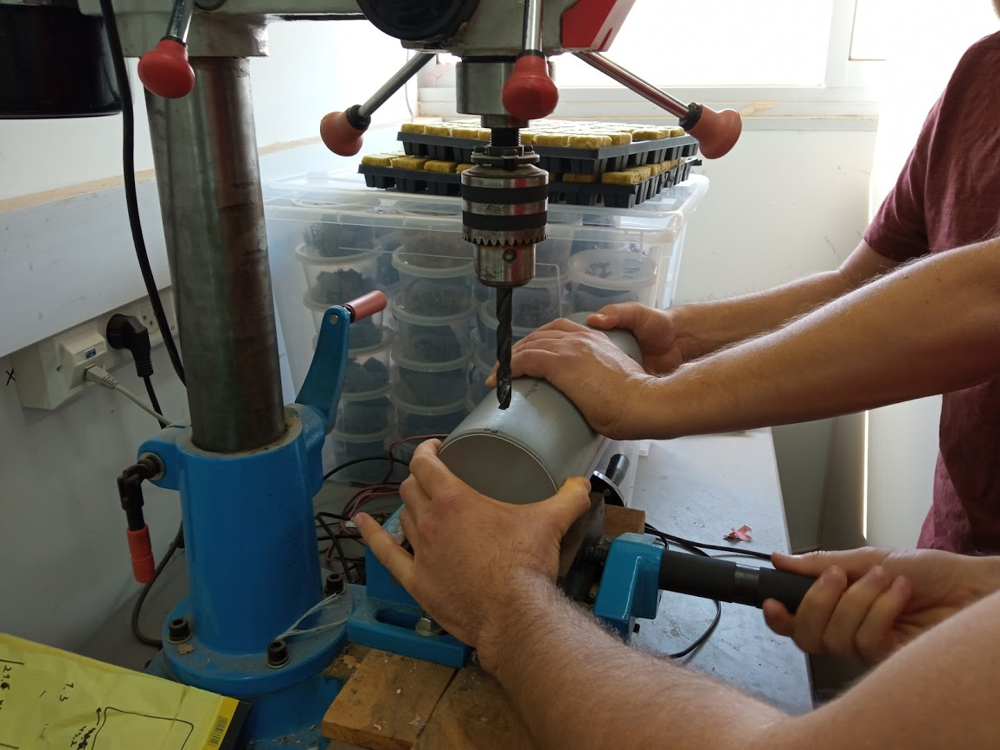
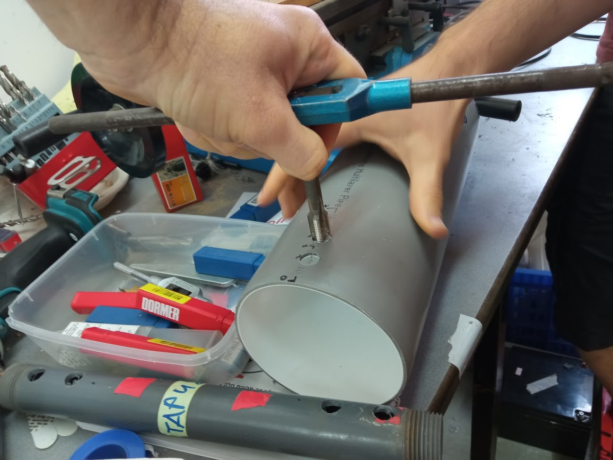

# Our first AgriTech project - Yedidya and Yehuda
Bilingual studies - Agronomy and Data

In this project we'll build an esp-32 based instrument for measuring hydraulic properties of soil. 

Take a look in the folder <a href="https://github.com/deedeeharris/agritech2021/tree/main/ard-sketch">'ard-sketch'</a> to see the sketches for the different sensors. 

We'll add here photos and the full code.

In addition, for detailed instructions take a look at our instructable: https://www.instructables.com/Measuring-Hydraulic-Properties-of-Soil-With-ESP32/

## Building the model:

### The pipe (for holding the saturated soil):

Materials:
* Piece of PVC pipe (7cm * ?? * ??) + cover
* 2 * PG-7
* Glue
* Thin plastic pipe (like in fish tanks / irrigation)
* ...

Instructions:
1. Cut a peice of the pipe.
2. Drill two holes for the PG, 2 cm apart. 
  
<kbd></kbd>
3. Use a tap wrench to make the holes good for PG.
  
<kbd></kbd>
